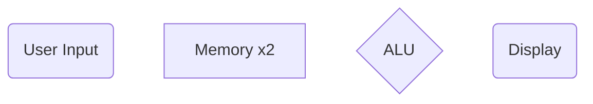
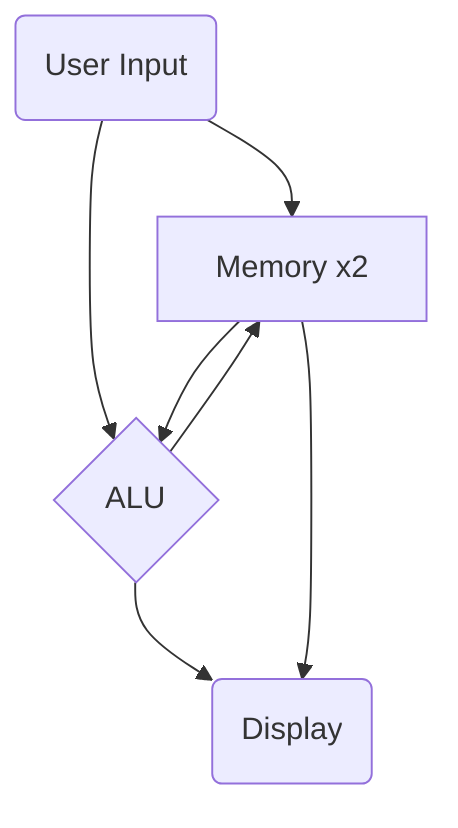

# Reverse Engineering the 2-Bit Full Redstone Computer

The most popular video on my Youtube channel is [2-bit full redstone computer](https://youtu.be/kDAdZQwo-nA?si=bf3J5s1U8ixAuHuC): unedited footage of Minecraft gameplay complete with a Mobizen screen recorder overlay and stock music that ends prematurely (giving a 37 second window into a conversation between my high school track teammates).

As a kid, I was really into Minecraft redstone computers because I thought they were the key to understanding how real computers worked. They're certainly easier to puzzle out than real computers. After learning a few basic redstone circuits, I thought I'd give it a try myself.

## Building a Computer

At the lowest level, computers are built from simple components like wires and transistors. Minecraft components do can the same thing. In fact, redstone dust, torches, and some type of solid block is all you need to build a machine capable of computing *anything* that's computable (in theory).

At the next level, transistors and wires combine to make more useful components. A basic computer needs memory for storing values, an arithmetic logic unit for performing computations, and some kind of input/output (to make it interesting).

I built a memory unit with two cells using pistons that push redstone blocks back and forth, between 0 and 1. For the Arithmetic Logic Unit (ALU), I used an online design for a "ripple-carry" adder that can add two binary numbers. Finally, I added some levers for simple binary input, and redstone lamps for output.



## The Data Path

Once I had all of the components, I wired them all together. This is called the *data path*, which defines how data can flow and be processed. I didn't know anything at the time, so I just wired the components the best I could:



The User Input (UI) connects to the memory and one of the ALU inputs. The memory connects to the other ALU input and the display. Finally, the ALU can send its output back to the memory or to the display. All of these connections are gated by pistons, so you have to toggle them open before data can flow.

Since I was building everything block by block, I decided to go small, and make it a 2-bit computer. Every connection has 2 parallel lines. The memory stores 2 2-bit values. And the ALU adds 2-bit numbers but sends 3 bits to the display in case there's an extra carry. The computer only works with numbers from 0-3, but this same design would work with any bit width.

## The Control Unit

This data path has all of the hardware needed to do calculations, but it requires manually flying around to toggle the gates and manage the memory. To centralize control, I created a 4-bit instruction input, which can operate 1 of 12 possible controls that I wired in. Here's the set of valid instructions (as copied from the video):

| Instruction | Result |
| - | - |
| 0101 | UI to ALU |
| 1010 | UI to mem |
| 0010 | ALU to mem |
| 0001 | ALU to disp |
| 1001 | mem to ALU |
| 0100 | mem to disp |
| 0011 | mem out cell 1 |
| 0111 | mem out cell 2 |
| 1100 | save to cell 1 |
| 1011 | save to cell 2 |
| 1000 | clear mem |
| 0110 | (UI?) |

All of the "component to component" and instructions are wired to flip flops, which toggle between on and off each time they're activated. The "mem out" functions change which cell the memory is outputting, and the "save to cell" functions are special because the memory won't do anything until one of these save functions is called. Other components, like the ALU, are always taking their inputs and/or broadcasting their outputs. I do not remember what "(UI?)" means, and I can't tell from the video.

This is not really a proper instruction set, but more akin to the concept of micro code. In modern processors, you can load values, process them, and save them with one single instruction. Under the hood, the control unit will handle all of these "micro instructions".

## Writing a Program

The number of interesting programs is very limited by my design. For example, you can't add 2 numbers in memory because the memory doesn't feed into both inputs of the ALU. But you *can* add a number from the UI and a number from the memory. This gave me the idea for the demo program which I demonstrated in my video:

```
1010 (UI to mem)
1100 (save to cell 1)
1010 (UI to mem)
0011 (mem out cell 1)
1001 (mem to ALU) 
0101 (UI to ALU)
0001 (ALU to disp)
```
First, the path is opened from the input to the memory. Then the input is saved to cell 1, and the path is toggled off again. The memory selects cell 1 as its output and the line from this memory cell to the ALU is opened. Next, the line from the input to the ALU is opened as well. At this point, the ALU is calculating the sum of the input and cell 1, which is the sum of the input and a copy of the input (aka input x2). Finally, this number is opened to go to the output display.

Double the user input, display it on screen.

This is definitely not how a modern computer *would* work, but I demonstrated to myself that I at least knew how a computer *could* work. No matter how strange or inefficient my 2-bit redstone computer was, it worked.