# SkyPuf (the game)

SkyPuf is the award-winning puzzle game hot off the presses from Vandergame Studios and Ko.

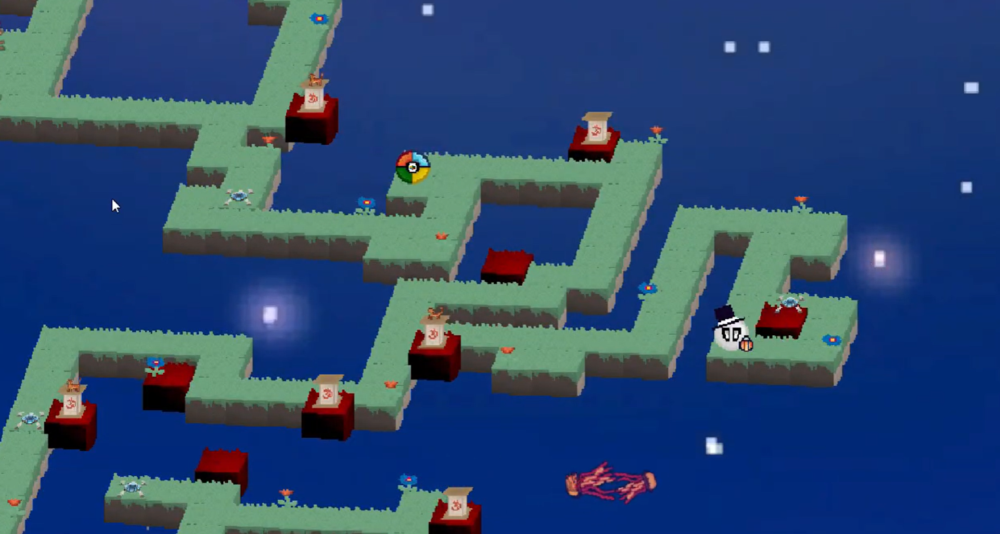
> A Player on Level 5

This game won first prize in my entertainment software design class. I have to give credit to the other members of Vandergame Studios for all of the graphics, sounds, UI, and many other small features and bugfixes. My territory was the gameplay and level design. Despite the simple rules, level design turned out to be a mind-bendingingly difficult task. Our final game shipped with 6 (semi) polished levels showing off some of the interesting designs I found, but it always bugged my inner perfectionist that there could be more interesting and more fun levels out there.

This blog post is an introduction to the puzzle mechanics of SkyPuf. I will be polishing and releasing the level editor I used, as well as the full game so you can load levels and play them with beautiful graphics and sounds. Levels can hypothetically be imported right into the game, but right now there's a lot of hardcoded magic values specific to the levels in the game.
Origin of the SkyPuf puzzle

I actually borrowed the SkyPuf gameplay mechanics from a previous Vandergames title that never reached completion: Scattered Skeleton.

Scattered skeleton was brought into existence for a game jam. At the launch event, they announced the theme: Reflection. And then the timer was ticking, so we had to think up an idea fast. I thought a simple puzzle game would be the easiest to implement in a short time. I decided to shoot for minimalism and mathematical purity. The rules for Scattered Skeleton were simple: move up, down, left, or right. Wall tiles block you from moving, lava tiles burn you up and kill you. The twist was reflection: every movement was reflected across multiple players on the screen, and the global movement would be applied to each player individually depending on its local environment.

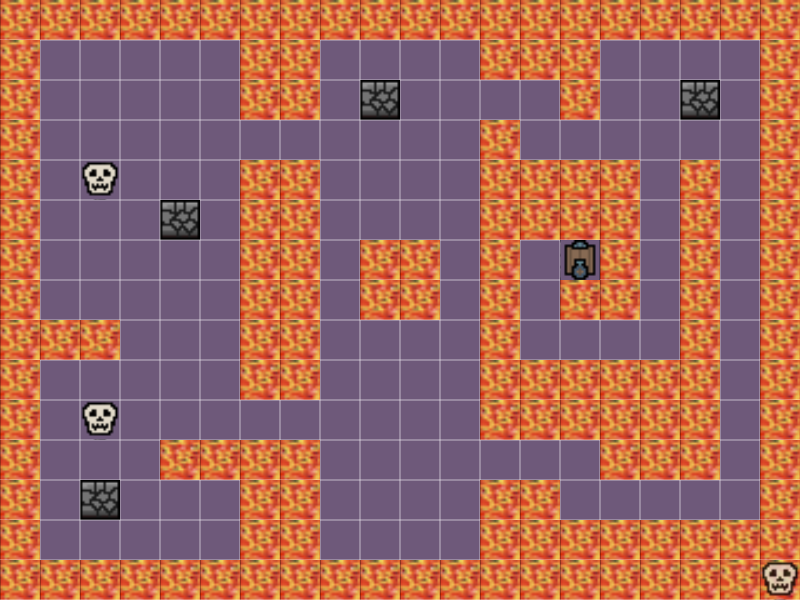

In the above level, moving down would move both skulls down one tile. Moving down again, the bottom one would get stuck, but the top one would shift down again. This was the first interesting level I ever made, and a version of it eventually found its way to SkyPuf.
Defining the puzzle

I am not the first person to invent puzzles involving global movement of separate players. And there have been mathematical papers published on puzzles in the same space, things like "multi-agent synchronized grid puzzles" and the like. However, I haven't seen any game or any paper with my exact formulation. I call my puzzle the Lockstep puzzle.

A Lockstep puzzle has an M x N grid of tiles: platform, wall, and deadly air. The game state S defines players occupying tiles on the grid. The objective is to get the players from a given starting state S0 to a given win state Sw. The controls are movement in the four cardinal directions. This movement is applied to each player in S simultaneously. If the tile they move to is a wall, they are blocked and remain on their previous tile. If it's air, the game is lost. There's any number of variations out there, but I think this is the simplest, and the complexity that emerges is worth investigating.

## Lockstep puzzle vs. SkyPuf puzzle

One of the first bits of emergent complexity is player combination. Once two players occupy the same tile, they will always remain together. Every movement will produce the same result since they are on the same tile, moving the same way. Nothing changes in the rules when two players find themselves merged, but now they act as one single player and the number of players in the state is essentially reduced by 1.

Lockstep is the general problem of getting players to a win state Sw, and SkyPuf puzzles are a subset of lockstep puzzles where Sw has all of the players on the same tile. The storyline of SkyPuf is that various "pufflings" are progressively merged to form the ultimate "Sky Puf".

## Valid, Invalid, and Softlock states

These rules don't disallow players on wall tiles or air tiles, it only says they can't move there. To patch this, we'll say that a state is valid if and only if every player's position corresponds to a platform tile. Pushing a player off the edge means making an invalid move. Disallowing careless deaths would have made SkyPuf less fun to player, but it also wouldn't get rid of the most interesting states: softlock states.

Note that a puzzle where a player's start position and finish position are not connected can have a valid start state and finish state, but it is not beatable. This is because the win state Sw is not within reach of the start state S0, or Sw is not in Reach(S0). Softlocks are dead ends, deaths that even careful movement can't avoid.

Softlocks can make gameplay frustrating when people don't realize they're stuck. To eliminate endless attempts to salvage an unsalvageable state I nearly added a level timer. Eventually, I improved my level design skills to a point where softlocks are a natural part of the game flow.

## Level 1

Here is level 1 in SkyPuf, as seen in the level editor. The light green is the platform tiles, dark green is walls, and the light blue is the deadly sky. The pink ball is our lone player, in its starting position.

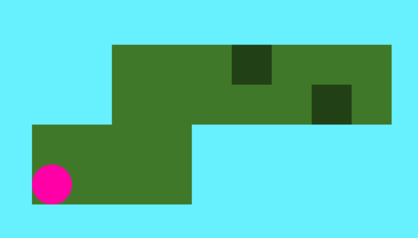

This is a super gentle introduction. There are platforms, walls, and air to teach people about the tile types. It is also short, because it doesn't take much time to learn. You'll notice I didn't mark a finish position. With only one player, it's easy to reach any finish tile and to walk across any bridge of platforms to go to the next level. Single player levels are just mazes, where the walls of the maze are air tiles or wall tiles. Any finish tile can be reached by solving the maze. If the finish tile is unreachable, then the game was unbeatable from the start. With only one player, level 1 is guaranteed un-softlock-able.

## Level 2

In level 2, we introduce two player puzzles. The question is, do we get more interesting behavior? As I was relieved to find when building Scattered Skeleton, yes. Now you're not just moving a single player point, but an amalgamation of players spread across the grid. Without walls, multi-player levels also become unsoftlockable maze levels. If the win state is reachable from the start, then it is always reachable. Any move that put the state in a softlock state could be undone with the reverse move, proving it was not truly in a softlock. The only way to reach a softlock state is if you started in softlock, meaning the level was unbeatable. With a single player, walls and air do the same job of defining invalidity. With multiple players, walls add the ability for some of the players to move while some remain in place. This changes the relative positions of different players or the "shape" of the mutli-player amalgamation. And this changes everything.

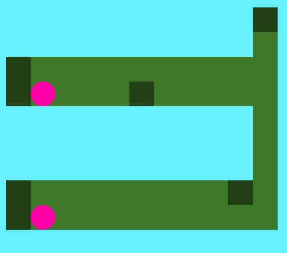

The person playing this level sees the next level connected in the upper right, and their players on the left side of parallel bridges. They begin moving rightwards, but something happens when the top player reaches the wall. It stops, but the bottom player continues. They're desynced. Offset. And they can't fit on the thin vertical bridge at the same time. When they reverse their moves by going left, the damage is not undone, and the players move freely but offset. With multiple players, walls introduce irreversibility. Now, a poorly thought-out move can change a winnable state to a softlock state.

Since it's only the second level, I graciously added a backstop to the left of offsetting walls. People can go back, reset, and try again. The trick is to avoid the offsetting walls, and keep the players vertically aligned all the way to the right bridge, where moving up will eventually combine them. If they get offset, they must realize that they can't immediately proceed to the finish. They are in a sort of pseudo-softlock state, where they have to use many moves to reverse the missteps they made and get back on a solution path.

## Level 3

Level 3 is actually an evolution of the first Scattered Skeleton level. Recall what it looks like:

Here the finish line is explicitly marked with a trapdoor. The parallel bridges lining up with the starting state of the players implies the intended solution: the players move to the middle island, then the rightmost island, and combine before finding the finish. The bridges act like the connecting bridge from level 2. They are actually unsoftlockable maze sections since they have no walls. But since we now have multiple players, these mazes require the players to be in the right "shape" too, with correct relative positioning. The section from the first island to the second is very short, but it requires the top and bottom players to be exactly 6 tiles apart in the vertical direction. Otherwise, they won't fit across the bridge. This tiny, mutli-player maze requiring a precise shape to move through is what I call a filter. 

Now, the level flow makes sense. The walls in the first island are used to manipulate the shape of the players (their relative spacing), then the filter enforces that the players are in the correct shape to pass to the middle island. The wall in the second island must be used to manipulate the players to fit the next filter, which requires the players to be 8 tiles apart in the vertical direction, and the offset turn requires the bottom player to be 1 tile ahead in the horizontal direction. The finish spiral is only beatable by a single combined player, so the final wall must be used to combine the players.

Level 2 is actually similar. The starting state is already the right shape (aligned vertically), so the walls are strategically avoided to maintain the correct shape and fit the vertical bridge filter.

But in the original prototype level, it's possible to combine the players on the very first island, and it's a trivial single player walk to the end. This is an important discovery:
Combined players can bypass any filter (in SkyPuf)

Any filter requiring a certain shape of x players can also be beat with any number of players less than x. In general, this makes filters "easier" to pass through. A 5-player filter can be bypassed with 3 players, and they have 2 less player-constraints to worry about. Passing a filter with one player is as easy as a single player level. This is why level 2 has an air gap between the top and bottom players, and the final level 3 is the same way too. Early combination breaks SkyPuf levels.

But not all lockstep puzzles! A general lockstep puzzle can have a win state that requires separated players on different tiles, and combined players can never become desynced again. This is why I define SkyPuf puzzles as their own subgroup, because their level design requires allowing combining at end, but disallowing combination throughout the solution path. This also implies a sort of reverse SkyPuf lockstep puzzle, where players start close together and must avoid combination as an obstacle while they move to separate finish positions.

## Level 3 (for real)

Here's the final, evolved version of level 3 that made it to SkyPuf:

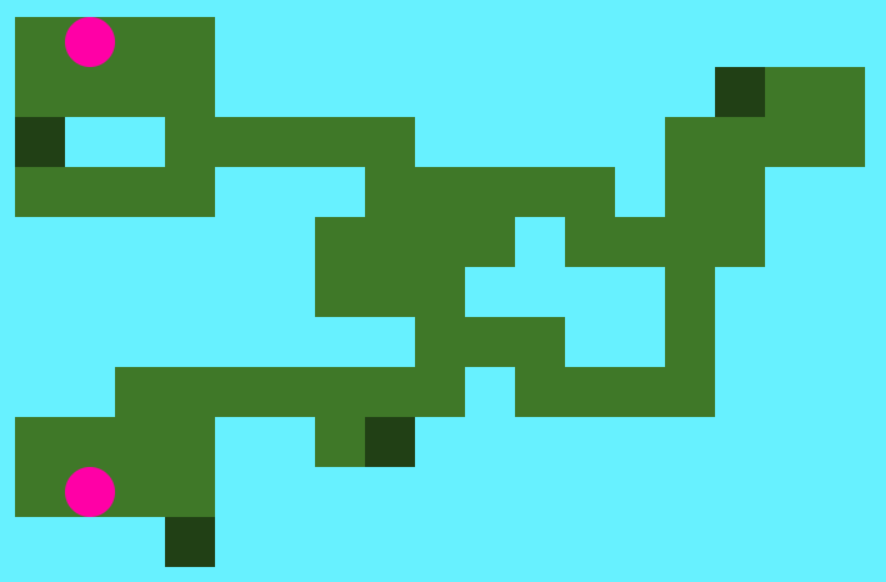

The first island has been destroyed. The top and bottom player are now separated by air, unable to mix. Each separate island has been decimated as well, in order to minimize the size of the puzzle and to avoid tiles horizontal to walls. Playtesters were previously able to offset one player all the way across the map while its counterpart remained on its starting island. This broke the shape, filter, shape, filter, shape, filter flow that I had intended. It also blew up the number of reachable states, Reach(S0). I wasn't sure if these unexpected states were winnable or softlocked. I started to realize the complexity emerging from these puzzles.

Instead of taking a deep dive into this complexity and the world of alternate paths, I made the first walls only accessible from vertical directions. This forced the players to remain vertically aligned and hinted to people that they needed to fix the vertical gap in order to progress to the middle. The middle island is physically connected, but the setup makes it impossible to combine early. It's easiest to just place a physical barrier to avoid combination, but clever setups with known reachable states can be used as well.

Now walls aren't ever obstacles, but every wall is important for the solution, ideally in multiple places from multiple sides. I also removed unnecessary tiles. These modifications make the level more minimalist, avoid softlocks, and can hint to the player how to proceed. They can also make the solution more obvious and the level easier to beat. There's a tradeoff where more reachable states make levels deeper, but they also make levels harder to control with shortcuts and softlocks creeping in. Ultimately, with later levels, I allowed softlock states to remain in, as long as it was easy enough for someone to see when they were softlocked without wasting too much time trying to get back on track. Annoyingly, this level 3 is still softlockable in the middle section, but it's a softlock I allow.

## Level 4

Level 4 improved things incrementally.

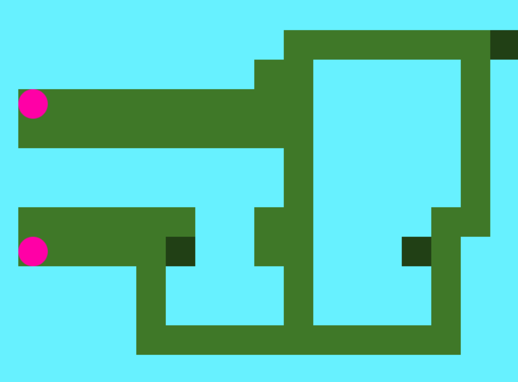

The first filter actually involves aligning the players horizontally, 4 tiles apart. That way they can go down the left and middle bridges to the bottom, over, and up the middle and right bridges. I liked this level because the player's separate movement paths overlap on the bottom bridge, but they are helpless to combine early. Also, the wall for generating the correct offset is used from the side, the top, and then the side again in a lovely multipurpose way. The bottom player sticks close to the wall and remains mostly stationary as the top player find its way to the correct placement.

## Level 5

Here's level 5, which makes extensive use of this split between static and dynamic roles.

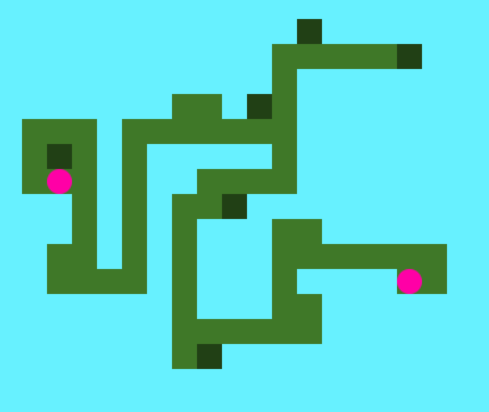

You can see the how the player on the left starts next to a wall which it can hit from any side. The "free" player has a series of bridges to cross that have no walls. The bumps at the start and on the corners allow the static player to maneuver to a safe side of the wall, where it will be safely stuck as the free player walks its bridge. When the bridge turns, the static player is readjusted again. The players even switch roles when the free player reaches a wall and allows the previously static player to venture off its islands and cross bridges with the same cornering method.

## Level 6

For the final level, I knew I had to make a level with more than 2 players, but the complexity seemed like it might explode. Ultimately, I shipped this level:

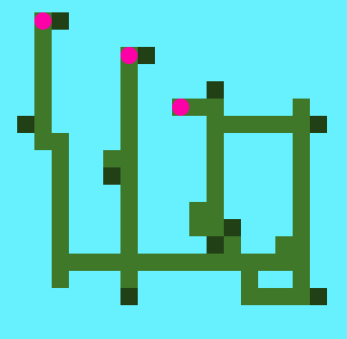

I was sort of disappointed in the result though. The level flow involves combining two of the players first, and then it's just a 2-player game. The only upgrade is that during the combination of the first two, there's a third dead weight player that must be carefully considered before each move. And if you think about any 3-player level, they all seem to follow the same sort of flow where you combine two and then combine the last. What actually happens as you increased the number of players in a puzzle?

## The Screwdriver

Before I start speculating about super complex multiplayer puzzles, here's a unique SkyPuf puzzle I found that didn't make the cut:

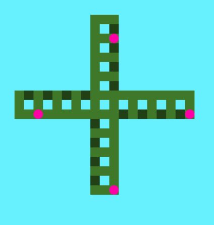

The solution is repetitive: up up, left left, down down, right right, and repeat. A free player would move in a loop, but the players in this map encounter walls which impede their loop. The player on the right moves up, left, down, but it can't move right. Every repetition brings it leftwards. Each arm is similarly set up to bring its player closer to the middle, where they will eventually combine. Interestingly, if you start looping clockwise (left, up, right, down) before the players irreversibly combine, they instead ratchet outwards. Turning one way brings them together, the opposite pulls them apart, hence the screwdriver name.

## More players

This is sort of the frontier of my current knowledge. Reaching a win state or passing a filter requires having the players in the right relative positions, or the right shape. In SkyPuf puzzles, this relative positioning is combination, where all of the players are at the exact same position. But shape-changing moves only happen when some players are free to move, and some are stuck behind a wall. Wall moves are what make lockstep puzzles interesting and irreversible. With 3 players, the options for a shape-changing move become either 1 player is stuck and 2 players move, or 2 players are stuck and 1 player moves. The last move in the sequence that creates correct relative alignment from misalignment. In both cases, 1 player is moving relative to the other 2. And the other 2 players must have correct relative spacing with each other, since this doesn't change and is correct once the whole group is relatively aligned. In either case, the situation must involve getting the correct spacing between two, and then getting the third aligned with the first two. We can draw an "alignment tree" to show the different ways the 3 players can become correctly aligned to win (or pass a filter). In a SkyPuf puzzle this tree shows combinations. And there's only one way to draw a binary tree with 3 leaves if you don't care about labels:

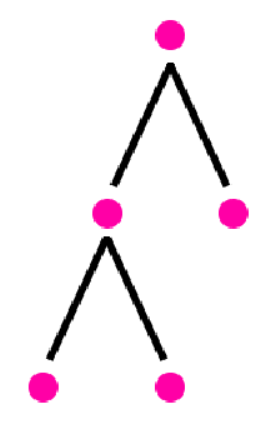

This gives a different lens through which we can view the complexity of lockstep puzzles. Complexity doesn't scale linearly from 1 to 2 to 3 players and beyond. Single player puzzles don't require any alignment. The jump to 2 players adds another leaf to the tree, and the alignment problem. The jump to 3 players adds another leaf, another alignment, and you have an alignment inside an alignment, but unfortunately the rules only allow 2 relatively aligned groups to align at once, so the solution is a fixed story of combination then combination. There is a little jump with 4 players, though. Again, we get another leaf and another alignment, but now we have options on how those alignments can occur. Now, we can have 2 separate alignment events occur at the same time, but not with each other! (Or at different times)

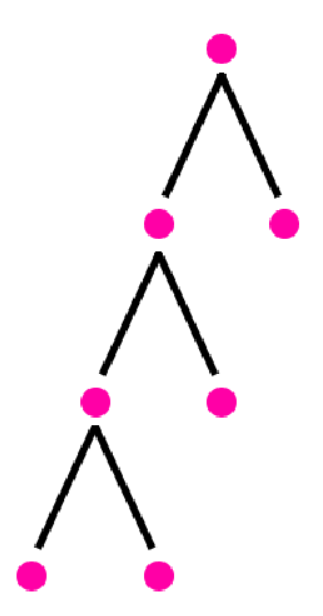
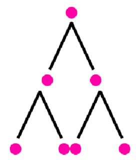

The real question is whether this adds much to the game experience. I expect not much. After 4 players, adding more players probably scales complexity somewhat linearly. Ultimately, the biggest jump is this alignment mechanic. And alignment can only ever do these binary partitions, splitting between those that move and those that don't. In a single player puzzle, walls are useless and partition is impossible. Adding more players allows for partitions, but these are always binary. This wall-partition theory explains how complexity emerges with multiple players in lockstep puzzles, but also it also explains how the rules ultimately bound the game and the complexity puzzles can reach.

